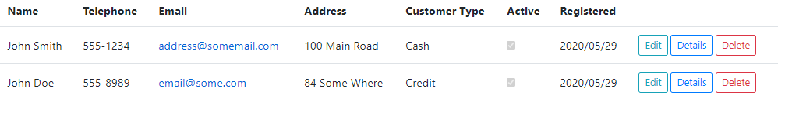
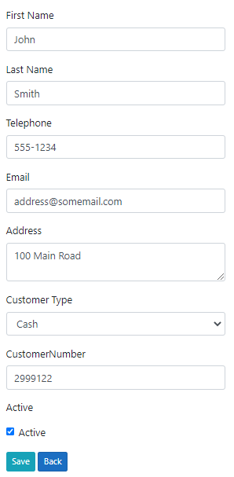

Blade for Razor - Dynamic Content for ASP.NET Core
==================================================

Blade for Razer is a framework for generating dynamic content for [ASP.NET Core](https://docs.microsoft.com/aspnet/core/).  The base framework comprises  a set of TagHelpers to dynamically generate content based on objects supplied at runtime. Blade for Razer is compatible with existing [.Net Scaffolding](https://github.com/dotnet/scaffolding), [Bootstrap](https://getbootstrap.com/) and [EF Core](https://github.com/dotnet/efcore). It can be used for both Razor Pages projects and ASP.Net Core MVC projects. 

## Introduction 

In **Blade for Razer** you can write:
```html
<form-index asp-for="Customers"></form-index>
```
And the result is:



Or you can write:
```html
<form method="post">
	<form-edit asp-for="Customer" asp-items="@Html.GetEnumSelectList<CustomerType>()"></form-edit>
    <form-submit asp-submit-text="Save"></form-submit>
</form>
```

And the result is:



**Features of Blade for Razor**

* Index – List objects shown in tabular form with customisable item buttons
* Forms – Create and update objects with dynamically generated forms. 
* Details – View details on an object with auto-generated fields.
* Delete - Delete confirmation with auto-generated fields.
* Buttons and Links - Generate consistent link and submit buttons.
* Injected Style Interface - Based on Bootstrap which is dependency injected if required.
* Model Attribution - Most standard attributes such as DisplayAttribute and KeyAttribute are supported. 


## Getting Started

1. [Setup Blade for Razor](#Setup-Blade-for-Razor) - Start using Blade for Razer.
2. [Index Example](#Index-Example) - Generate an Index Page with tabular list of items.
3. [Form Example](#Form-Example) - Generate forms for create or update.
4. [Form Example with Detailed Control](#Form-Example-with-Detailed-Control) - Generate forms with more control over layout.
5. [Advanced - MVC with Dynamic Shared Views](#Advanced---MVC-with-Dynamic-Shared-Views) - It then becomes possible to have a *single* set of shared views for all objects in an application. 
6. [Contact](#Contact) - Contact me if you require assistance or to report bugs. I'll try my best!

## Setup Blade for Razor

Some stuff here

## Index Example 
In Blade for Razer you can write Razer Syntax as follows. 
```html
<h2>Index</h2>
<form-index asp-for="Customers"></form-index>
```
An example of the resulting output is shown below. The buttons are hooked up by default and are customisable.


This is instead of writing the standard Razer Syntax as summarised below.
```html
<h2>Index</h2>
<table class="table">
    <thead>
        <tr>
            <th>
                @Html.DisplayNameFor(model => model.Customers[0].FullName)
            </th>
            <th>
                @Html.DisplayNameFor(model => model.Customers[0].Email)
            </th>            
            ...
            <th></th>
        </tr>
    </thead>
    <tbody>
        @foreach (var item in Model.Customers)
        {
            <tr>
                <td>
                    @Html.DisplayFor(modelItem => item.FullName)
                </td>               
                <td>
                    @Html.DisplayFor(modelItem => item.Email)
                </td>               
                ...
                <td>
                    <a asp-page="./Edit" asp-route-id="@item.Id">Edit</a> |
                    <a asp-page="./Details" asp-route-id="@item.Id">Details</a> |
                    <a asp-page="./Delete" asp-route-id="@item.Id">Delete</a>
                </td>
            </tr>
        }
    </tbody>
</table>
```

Take a look at the **BladeRazorExamples** project for the full implementation, specifically at the *Examples/Customers/Index* Page.

## Form Example

This is demonstrated in the **BladeRazorExamples** example application. To generate a form (for create or update) the syntax is as follows.
```html
<form-div>
    <form method="post">
        <form-edit asp-for="Customer" asp-items="@Html.GetEnumSelectList<CustomerType>()"></form-edit>
        <form-submit asp-submit-text="Save"></form-submit>
    </form>
</form-div>
```

An example of the generated form is shown below.


By comparison, a summary of the standard *Razor Syntax* to generate the same is shown below.
```html
<div class="row">
    <div class="col-md-4">
        <form method="post">
            <div asp-validation-summary="ModelOnly" class="text-danger"></div>
            <input type="hidden" asp-for="Customer.Id" />
            <div class="form-group">
                <label asp-for="Customer.FirstName" class="control-label"></label>
                <input asp-for="Customer.FirstName" class="form-control" />
                <span asp-validation-for="Customer.FirstName" class="text-danger"></span>
            </div>
           	...
            <div class="form-group">
                <label asp-for="Customer.CustomerType" class="control-label"></label>
                <select asp-for="Customer.CustomerType" class="form-control" 
					asp-items="@Html.GetEnumSelectList<CustomerType>()"></select>
                <span asp-validation-for="Customer.CustomerType" class="text-danger"></span>
            </div>
            <div class="form-group form-check">
                <label class="form-check-label">
                    <input class="form-check-input" asp-for="Customer.Active" /> 
						@Html.DisplayNameFor(model => model.Customer.Active)
                </label>
            </div>
            <div class="form-group">
                <input type="submit" value="Save" class="btn btn-primary" />
            </div>
        </form>
    </div>
</div>
<div>
    <a asp-page="./Index">Back to List</a>
</div>
```

Take a look at the **BladeRazorExamples** project for full implementation, specifically at the *Examples/Customers/Edit* Page.

## Form Example with Detailed Control

The framework allows for more control over form layout. An example of this is shown below, and the resulting form will be identical to the one shown above. 
```html
<form-div>
    <form method="post">
        <form-hidden asp-for="Customer.Id"></form-hidden>
        <form-input asp-for="Customer.FirstName"></form-input>
        <form-input asp-for="Customer.LastName"></form-input>
        <form-input asp-for="Customer.Telephone"></form-input>
        <form-input asp-for="Customer.Email"></form-input>
        <form-input asp-for="Customer.Address"></form-input>
        <form-input asp-for="Customer.CustomerType"></form-input>
        <form-checkbox asp-for="Customer.Active"></form-checkbox>
        <form-submit asp-submit-text="Save"></form-submit>
    </form>
</form-div>
```


Take a look at the **BladeRazorExamples** project for full implementation, specifically at the *Examples/Customers/Edit* Page.


## Advanced - MVC with Dynamic Shared Views 

Because the content generation is dynamic, it becomes possible to have a *single* set of shared views for all CRUD operations throughout the application - regardless of object type.

This is demonstrated in the **BladeRazorMvcExamples** example application. 

The shared views are as follows.
* **Index** - The Index view with a tabulated list of entries.
* **Create** - The view for entry creation.
* **Details** - The view for displaying entry details.
* **Edit** - The view for editing existing objects.
* **Delete** - The view for delete confirmation.

An example of the *Index* view is shown below. 

```html
@model BladeRazorMvcExamples.ViewModels.BladeViewModel

<h2>@Model.DynamicModel.GetType().Name List - Blade</h2>
<form-new-button asp-action="Create" asp-display-icon="false"></form-new-button>
<form-index-mvc asp-for="DynamicList" asp-headers-for="DynamicModel"></form-index-mvc>
```

And an example of the *Edit* view is shown below.

```html
@model BladeRazorMvcExamples.ViewModels.BladeViewModel

<h2>Edit @Model.DynamicModel.GetType().Name - Blade</h2>
<hr />
<form-div>
    <form asp-action="Edit">
        <form-edit  asp-for="DynamicModel" asp-items="@Model.SelectItems" 
					asp-items-dictionary="@Model.SelectItemsDictionary"></form-edit>
        <form-submit asp-submit-text="Save" asp-cancel-action="Index"></form-submit>
    </form>
</form-div>
```

An example of the *ViewModel* is shown below.

```csharp
public class BladeViewModel
{
	public dynamic DynamicModel { get; set; } = null;
    public ICollection<dynamic> DynamicList { get; set; } = null;
    public IEnumerable<SelectListItem> SelectItems { get; set; } = null;
    public IDictionary<string, IEnumerable<SelectListItem>> SelectItemsDictionary { get; set; } = null;
       
    public BladeViewModel(dynamic dynamicModel)
    {
		this.DynamicModel = dynamicModel;
    }
}
```

The dynamic fields in the ViewModel allow the *Controller* to return the shared view with any object. Blade for Razer then generates the content on the fly based on the object.
An example of the controller code for *Index* generation is shown below. 
```csharp
public async Task<IActionResult> Index()
{
    var customers = await _context.Customers.ToArrayAsync();                            
    return View("BladeIndex", new BladeViewModel(new Customer()) { DynamicList = customers });
}
```

For more information take a look at the **BladeRazorMvcExamples** example application. Specifically at the *Shared Views* and the *BladeViewModel* class.


## Contact

Links and things

## Lincense
